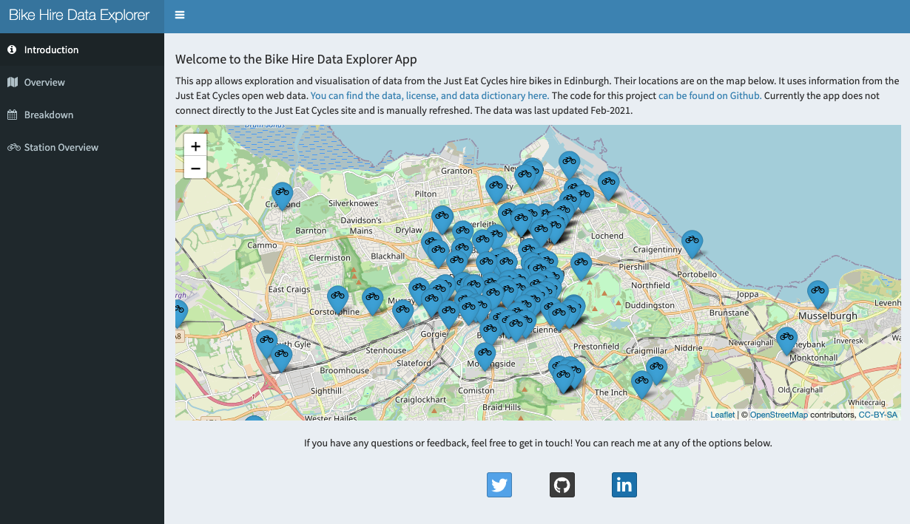
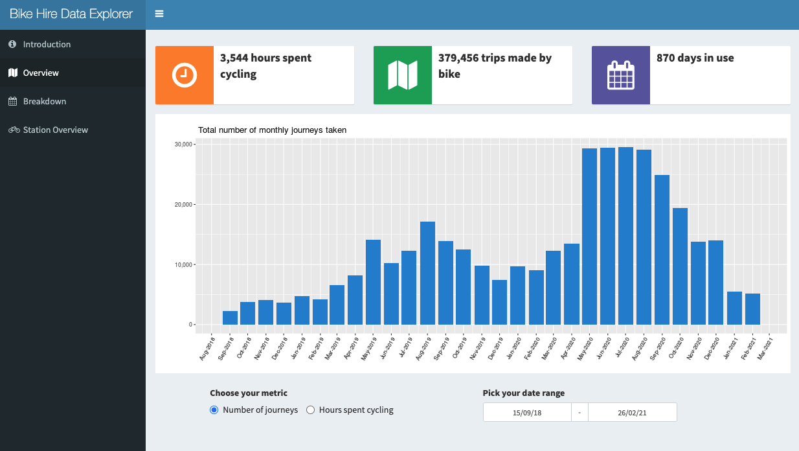
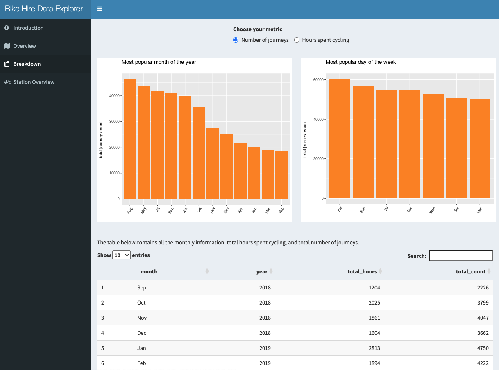
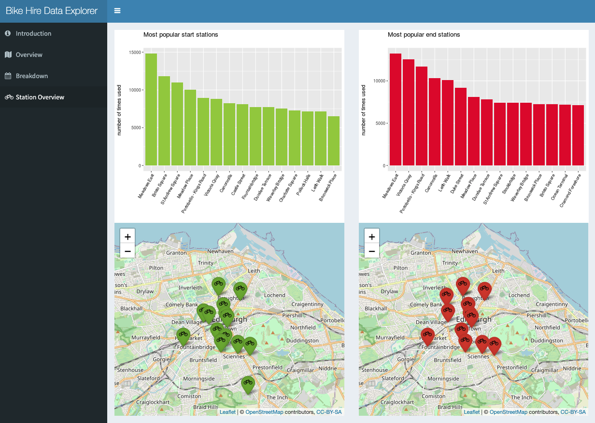
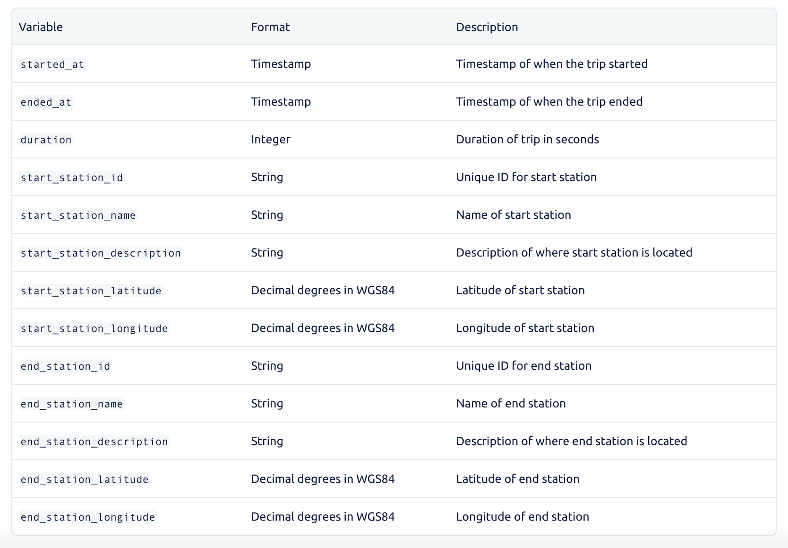

## Edinburgh Bike Hire Data App

  

  

You can access the full app here: [stephanie-boyle.shinyapps.io/](https://stephanie-boyle.shinyapps.io/edinburgh_bike_hire_data_app/)

This app allows exploration and visualisation of data from the Just Eat Cycles hire bikes in Edinburgh. Their locations are on the map below. It uses information from the Just Eat Cycles open web data. You can find the data, license, and data dictionary here. The code for this project can be found on Github. Currently the app does not connect directly to the Just Eat Cycles site and is manually refreshed. The data was last updated Feb-2021.

[The data can be found here](https://edinburghcyclehire.com/open-data/historical)

 

## What's in the App?

The app contains four tabs: `introduction`, `overview`, `breakdown` and `stations`. 

### Intro Tab 

This contains an overivew of the app, and shows all stations included in the data. 

### Overview Tab

Here, you can choose the date range you wish to view, and can toggle between number of journeys/hours spent cycling. 

### Breakdown Tab

On this tab, you can view the data by month or weekday. You can again choose between number of journeys taken and hours spent cycling. You also have the option to view a table of all data in the app. 

### Stations Tab

On this final tab, you can see the top start and end stations, as well as their locations. 

  

## Data Details 

All code can be found on github: [https://github.com/stephanieboyle/bike_hire_shiny_app](https://github.com/stephanieboyle/bike_hire_shiny_app)

The data can be found here: [https://edinburghcyclehire.com/open-data](https://edinburghcyclehire.com/open-data)

The data dictionary for the variables is listed below:

 

Date: 22/03/2021   
Author: [Stephanie Boyle](https://twitter.com/_stephanieboyle)